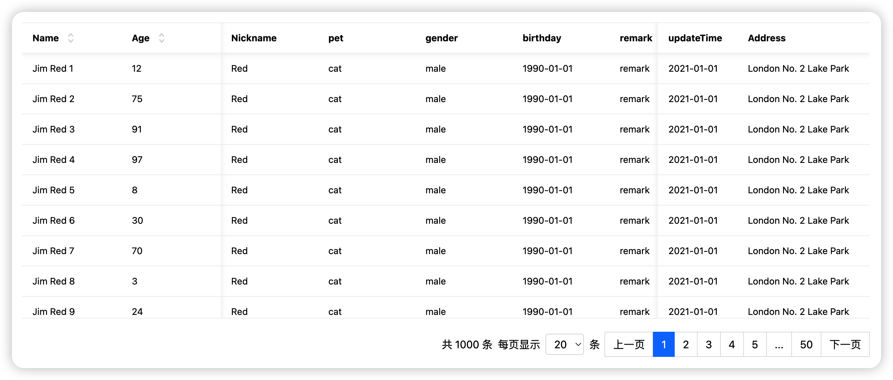

# React 表格组件库（TypeScript + Rollup）

## 概述

本项目是一个使用 TypeScript 编写的 React 表格组件库，通过 Rollup 进行打包。它提供了高级功能，如固定表头、点击列头排序、水平滚动时固定左/右列以及前端分页等。非常适合用于展示和组织大量数据。

## 功能特性

- **固定表头**：表头始终保持在视口顶部，提高用户滚动查看长表格时的体验。
- **列排序**：用户可以通过点击列头对表格行进行排序，支持升序和降序。
- **固定列**：支持在水平滚动时固定左侧或右侧的列数。
- **分页**：支持前端分页，并允许自定义页面大小，以便高效地加载和显示大量数据集。

## 示例

### 截图



### 演示


## 开始使用

### 安装

要在你的 React 项目中使用这个表格库，首先需要安装它。假设你使用 npm 或 yarn 作为包管理器：

```bash
npm install @sunyf/table-component --save
# 或者
yarn add @sunyf/table-component
```

请将 `@sunyf/table-component` 替换为你的 npm 包名或本地构建的库的实际路径。

### 基本用法

以下是一个在 React 应用中使用 `Table` 组件的基本示例：

```jsx
import React, { useState } from 'react';
import Table, { ColumnType } from '@sunyf/table-component';
import '@sunyf/table-component/css/index.css';

interface User {
  key: string;
  // 姓名
  name: string;
  // 年龄
  age: number;
  // 昵称
  nickname: string;
  // 地址
  address: string;
  // 性别
  gender: string;
}

const columns: ColumnType<User>[] = [
  {
    title: 'Name',
    dataIndex: 'name',
    key: 'name',
    sortable: true,
    width: 150,
    fixed: 'left',
  },
  {
    title: 'Age',
    dataIndex: 'age',
    key: 'age',
    sortable: true,
    width: 150,
    fixed: 'left',
  },
  {
    title: 'Nickname',
    dataIndex: 'nickname',
    key: 'nickname',
  },
  {
    title: 'gender',
    dataIndex: 'gender',
    key: 'gender',
  },
  {
    title: 'Address',
    dataIndex: 'address',
    key: 'address',
    width: 200,
    fixed: 'right',
  },
  // 添加更多列
];

const dataSource = [
  { id: 1, name: 'Alice', age: 25 },
  { id: 2, name: 'Bob', age: 30 },
  // 添加更多数据行
];

function MyComponent() {
  const [pagenation, setPagenation] = useState({
    current: 1,
    total: dataSource.length,
    pageSize: 20,
  });

  return (
    <Table
      columns={columns}
      dataSource={dataSource}
      scroll={{ x: 1500, y: 400 }}
      sticky
      pagenation={{
        current: pagenation.current,
        total: pagenation.total,
        pageSize: pagenation.pageSize,
        onChange: (page) => setPagenation({ ...pagenation, current: page }),
        onPageSizeChange: (page, size) => setPagenation({ ...pagenation, current: page, pageSize: size })
      }} />
  );
}

export default MyComponent;
```

### 属性

- `columns`：数组，表示表格的列配置。每个列配置是一个对象，包含以下属性：
- `dataSource`：对象数组，表示表格的数据源。
- `pagenation`：对象，包含分页信息，包括当前页码、总记录数、每页显示记录数以及分页变化时的回调函数。
- `sticky`：可选，布尔值，指定是否启用固定表头。默认为 `false`。
- `scroll`：可选，对象，指定表格的滚动行为。`x` 和 `y` 分别表示水平滚动和垂直滚动的宽度。

### 构建和贡献

安装依赖：

```bash
npm run install:all
or
yarn install:all
```

本地启动开发环境：

```bash
npm run dev
or
yarn dev
```

要构建这个库，请运行以下命令：

```bash
npm run build
or
yarn build
```

欢迎贡献！

## 许可证

本库使用 MIT 许可证。有关更多详细信息，请参阅 [LICENSE](LICENSE) 文件。
